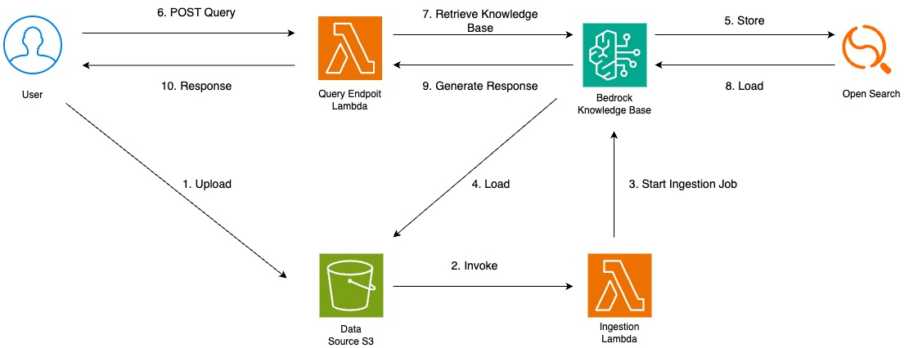

# RAG using AWS Bedrock

This is a test project that deploys an Amazon Bedrock knowledge base using AWS CDK.

## Architecture diagram

## Deploy infraestructure

`npx cdk deploy` deploy this stack to your default AWS account/region

## Upload data to S3

`aws s3 sync data s3://[AppStack.ResumeBucketName]`

## Cleanup

`npx cdk destroy --force`
